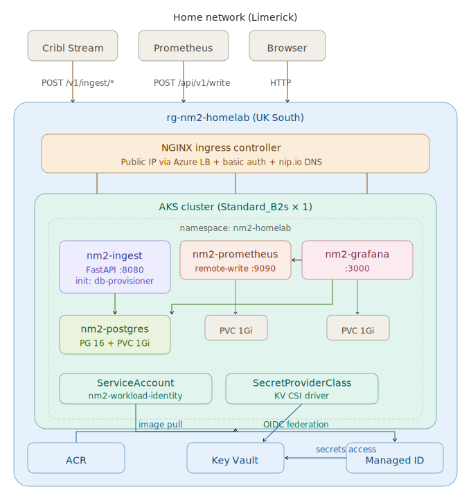

# nm2-homelab

Network state ingest platform deployed on Azure Kubernetes Service. Receives batched network telemetry via REST API, stores normalised relational state in PostgreSQL, accepts remote Prometheus metrics, and visualises everything in Grafana. All secrets sourced from Azure Key Vault via CSI driver with workload identity — no client secrets stored anywhere.

## Architecture



## Azure Resources

The `deploy-azure.sh` script provisions all of the following in a single resource group (`rg-nm2-homelab`):

| Resource | Purpose |
|---|---|
| AKS cluster (`Standard_B2s` × 1) | Runs all workloads. OIDC issuer + workload identity + KV CSI addon enabled. |
| ACR (Basic) | Container registry for the two custom images. AKS has pull access via `--attach-acr`. |
| Key Vault (RBAC mode) | Stores all database and application secrets. No access policies — RBAC only. |
| Managed Identity | Assigned "Key Vault Secrets User" on the KV. Federated to the k8s ServiceAccount via OIDC. |
| NGINX Ingress Controller | Public Azure Load Balancer. Basic auth on ingest API and Prometheus. Grafana uses its own login. |

Teardown: `./scripts/deploy-azure.sh --teardown` deletes the entire resource group + purges the soft-deleted Key Vault.

## Secret Management

Secrets are sourced from Azure Key Vault using the **CSI Secrets Store driver** with **AKS workload identity**. No client secrets, certificates, or service principal credentials are stored in the cluster.

**Trust chain:** Pod → Kubernetes ServiceAccount JWT → AKS OIDC issuer → Azure AD federation → Managed Identity → Key Vault RBAC → secrets synced to k8s Secrets.

The chart supports two modes via `keyvault.enabled`:

| Mode | `keyvault.enabled` | How secrets reach pods |
|---|---|---|
| Azure (default for `deploy-azure.sh`) | `true` | Key Vault → CSI driver → k8s Secrets |
| Standalone / local dev | `false` | `values.yaml` → k8s Secrets directly |

In both modes, all Deployments consume the same two k8s Secrets by name — no template changes between modes:

| Secret Name | Keys |
|---|---|
| `nm2-db-credentials` | `POSTGRES_USER`, `POSTGRES_PASSWORD`, `POSTGRES_DB`, `POSTGRES_ADMIN_URI`, `INGEST_PASSWORD`, `INGEST_DB_URI`, `GRAFANA_PASSWORD`, `GRAFANA_DB_URI` |
| `nm2-grafana-credentials` | `GF_SECURITY_ADMIN_USER`, `GF_SECURITY_ADMIN_PASSWORD` |

**Key Vault secret names** expected (see `templates/secrets-keyvault.yaml` for the full mapping):

```
nm2-postgres-user, nm2-postgres-password, nm2-postgres-db,
nm2-postgres-admin-uri, nm2-ingest-password, nm2-ingest-db-uri,
nm2-grafana-password, nm2-grafana-db-uri,
nm2-grafana-admin-user, nm2-grafana-admin-password
```

## Ingest Pod Design

The `nm2-ingest` Deployment has two containers:

**Init container (`db-provisioner`):** Connects to PostgreSQL as the admin user and idempotently provisions the `nm2` schema, all tables, indexes, two database roles (`nm2_ingest` for read/write, `nm2_grafana` for read-only), and grants. Safe to re-run on every pod restart. This replaces the need for manual database migration tooling.

**Main container (`ingest-api`):** FastAPI service on port 8080 with an asyncpg connection pool. Exposes typed endpoints for each table — Cribl (or any HTTP client) posts batched records and gets upserts via `ON CONFLICT` clauses.

## Database Schema

All tables live in the `nm2` schema. Relational and normalised — no JSONB, designed for straightforward Grafana SQL queries.

| Table | Upsert Key | Purpose |
|---|---|---|
| `devices` | `device_id` | Device inventory (hostname, platform, OS, serial, mgmt IP) |
| `interfaces` | `(device_id, name)` | Interface state, counters, addressing |
| `bgp_peers` | `(device_id, vrf, peer_ip)` | BGP peer state, prefix counts, uptime |
| `lldp_neighbors` | `(device_id, local_interface)` | LLDP adjacency discovery |
| `routes` | `(device_id, vrf, prefix, protocol, next_hop, next_hop_interface)` | RIB entries |
| `events` | append-only | Time-series events, syslogs, state transitions |

## API Endpoints

| Method | Path | Description |
|---|---|---|
| `POST` | `/v1/ingest/devices` | Upsert device inventory |
| `POST` | `/v1/ingest/interfaces` | Upsert interface state |
| `POST` | `/v1/ingest/bgp_peers` | Upsert BGP peer state |
| `POST` | `/v1/ingest/lldp_neighbors` | Upsert LLDP neighbors |
| `POST` | `/v1/ingest/routes` | Upsert routes |
| `POST` | `/v1/ingest/events` | Append events (no upsert) |
| `GET` | `/healthz` | Liveness probe |
| `GET` | `/readyz` | Readiness probe (checks PG connection pool) |

All POST endpoints accept `{"records": [...]}` and return `{"accepted": N, "errors": [...]}`.

## Prometheus

Standalone Prometheus with persistent storage (`managed-csi`), 30-day retention, and Kubernetes pod service discovery within the namespace. Configured to scrape the ingest API and any pod annotated with `prometheus.io/scrape: "true"`.

**Remote write receiver** is enabled in the Azure deployment (`prometheus.remoteWriteReceiver: true`), allowing external Prometheus instances or agents to push metrics to `POST /api/v1/write`. This endpoint is protected by basic auth via the NGINX ingress.

Grafana is pre-provisioned with Prometheus as the default datasource.

## Prerequisites

- Azure CLI (`az`) authenticated to a subscription
- Docker (for building amd64 images — works from Mac via cross-compilation)
- Helm 3
- `kubectl`

## Quick Start (Azure)

```bash
# 1. Clone the repo
git clone https://github.com/ryaneoin/nm2-homelab.git
cd nm2-homelab

# 2. Deploy everything (provisions Azure infra + builds + deploys)
chmod +x scripts/deploy-azure.sh
./scripts/deploy-azure.sh

# 3. The script outputs public URLs when complete, e.g.:
#    Grafana:    http://grafana.<IP>.nip.io
#    Ingest:     http://ingest.<IP>.nip.io
#    Prometheus: http://prometheus.<IP>.nip.io

# 4. Test the ingest API
curl -u nm2:nm2_secure_api \
  -X POST http://ingest.<IP>.nip.io/v1/ingest/devices \
  -H 'Content-Type: application/json' \
  -d '{"records": [{"device_id": "spine1", "hostname": "spine1.dc1", "platform": "eos"}]}'

# 5. Verify in Grafana (Explore → nm2-postgres → Code editor)
#    SELECT * FROM nm2.devices;

# 6. Teardown when done (~€2-3/day while running)
./scripts/deploy-azure.sh --teardown
```

## Deploy Script Options

```bash
./scripts/deploy-azure.sh              # Full: provision + build + deploy
./scripts/deploy-azure.sh --skip-infra # Skip Azure provisioning (already exists)
./scripts/deploy-azure.sh --skip-build # Skip image build/push (already in ACR)
./scripts/deploy-azure.sh --teardown   # Delete resource group + purge Key Vault
```

## Project Structure

```
nm2-homelab/
├── docs/
│   └── architecture.svg               ← architecture diagram
├── helm/nm2-homelab/
│   ├── Chart.yaml
│   ├── values.yaml                    ← defaults (keyvault off, local storage)
│   ├── templates/
│   │   ├── secrets.yaml               ← direct k8s Secrets (keyvault.enabled: false)
│   │   ├── secrets-keyvault.yaml      ← KV CSI + workload identity (keyvault.enabled: true)
│   │   ├── ingest-deployment.yaml     ← init container + main container
│   │   ├── postgres-*.yaml            ← in-cluster PG (swap for Azure Flexible Server in prod)
│   │   ├── prometheus-*.yaml          ← Prometheus + RBAC + PVC
│   │   ├── grafana-*.yaml             ← Grafana + auto-provisioned datasources
│   │   ├── ingress.yaml               ← NGINX with conditional basic auth
│   │   └── ingress-basic-auth.yaml    ← htpasswd Secret for NGINX
│   └── .helmignore
├── images/
│   ├── db-provisioner/                ← init container (Python + psycopg2)
│   └── ingest-api/                    ← FastAPI service (Python + asyncpg)
└── scripts/
    ├── deploy-azure.sh                ← full Azure provisioning + deployment
    └── deploy.sh                      ← homelab deployment (k3s + local registry)
```

## Production Adaptation Guide

This deployment is a working reference. For production, the dev team should focus on:

| Area | Current (this repo) | Production Target |
|---|---|---|
| PostgreSQL | In-cluster (this chart) | Azure Flexible Server via Terraform |
| Key Vault secrets | Demo passwords in deploy script | Real credentials managed via Terraform / IaC |
| Ingress | NGINX + nip.io + basic auth | NGINX or App Gateway + custom domain + TLS |
| Deployment | `deploy-azure.sh` (imperative) | ArgoCD GitOps (chart is compatible as-is) |
| AKS node size | `Standard_B2s` (single node) | Right-sized node pool per workload requirements |
| Managed Identity | Created by deploy script | Provisioned via Terraform with least-privilege RBAC |
| Container images | Built locally, pushed to ACR | CI/CD pipeline (GitHub Actions / Azure DevOps) |

The Helm chart itself requires minimal changes — the `keyvault.enabled: true` path is already the production path. The main work is moving the imperative Azure provisioning (`deploy-azure.sh`) into Terraform modules and wiring up a CI/CD pipeline for image builds.
